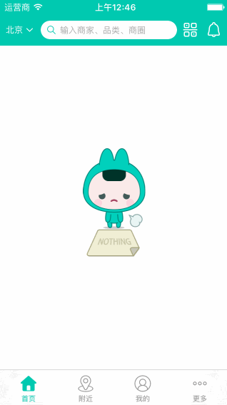

# BJNavigationController-Swift

[](https://developer.apple.com/swift/)
[](https://twitter.com/beijiahiddink)          

## 什么是BJNavigationController

本项目实现了类似美团侧滑返回的页面效果。



## 如何安装

### 手动安装

```ruby
git clone https://github.com/beijiahiddink/BJNavigationController-Swift.git
open BJNavigationController
```

## 该怎样去使用

项目核心代码较少，集成很方便！

### 核心文件

* BJNavigationController → 定制导航控制器
* BJCustomViewController → 定制导航控制器的子控制器
* BJNavigationBar → 提供了一些导航条的view

项目主要用子类化思想来最大化定制。

### BJNavigationController

这个控制器里面自定义了新的navigationBar，这也是实现主流侧滑的重要一步，集成了系统的边缘侧滑手势。

### BJCustomViewController

这个控制器提供了header和content两个view的视图层级，可以方便的实现现在最主流的侧滑效果，集成代码主要如下：

**定制header，需重写下列方法**

```swift
func loadHeaderView() {
    headerView = {
        //return header
    }()
}
```

**刷新navigationItem，需重写下列方法**

```swift
func reloadNavigationItem() {
    //do something
}
```

## 最后

喜欢本项目的可以给我:star2:[加星](https://github.com/beijiahiddink/BJNavigationController-Swift/stargazers)，希望大家給我的项目一些支持。

## License

BJNavigationController is released under the MIT license. See [LICENSE](LICENSE) for details. 